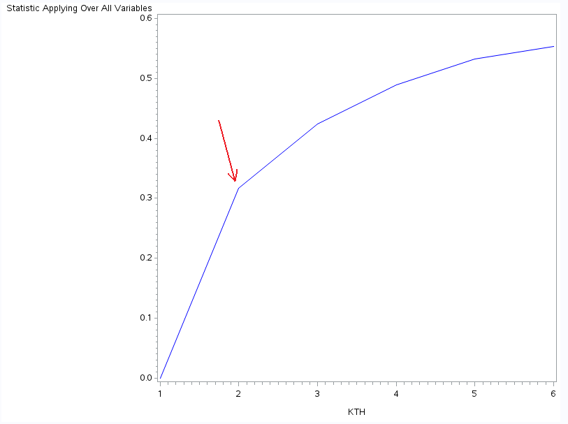
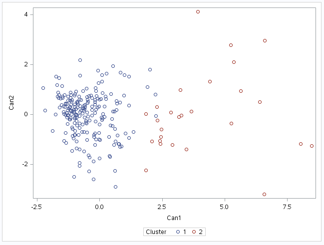

# Week 4 - K-Means Clustering

## SAS Code
```sas
LIBNAME mydata "/courses/d1406ae5ba27fe300 " access=readonly;

ods graphics on;

/* Set max K */
%LET maxK=6;

/* Import the liver data from csv file */
PROC IMPORT DATAFILE='/home/petersaunders10/kMeans/liver.csv' 
        OUT=imported_data REPLACE;
 
/* Standardize the blood test variables */
PROC STANDARD data=imported_data out=cluster_data mean=0 std=1; 
    var mcv alkphos sgpt sgot gammagt; 
RUN;

/* Split data randomly into test and training data */
PROC SURVEYSELECT data=cluster_data out=traintest seed=1234 samprate=0.7 method=srs outall;
RUN; 

DATA train_data;
    SET traintest;
    IF selected=1;
RUN;

DATA test_data;
    SET traintest;
    IF selected=0;
RUN;

/* Run K-means from 1 to K on train_data */
%MACRO kmeans(K);
    %DO i=1 %TO &K.;
        PROC FASTCLUS data=train_data out=kmeanResults&i. outstat=kmeanStats&i. 
        maxclusters=&i. maxiter=100;
            var mcv alkphos sgpt sgot gammagt;
        RUN;
    %END;
%MEND;

%kmeans(&maxK);

/* Extract R-squared value for each model */
%MACRO getRSquared(kth, kthStats);
    DATA rSquared&kth.;
    SET &kthStats.;
    KTH = &kth.;
    
    IF _TYPE_='RSQ';    
    KEEP KTH OVER_ALL;
    RUN;
%MEND;

%MACRO names(prefix, maxnum);
  %DO i=1 %TO &maxnum;
    &prefix&i
  %END;
  ;
%MEND;

%MACRO getAllRSquared(K);
    %DO i = 1 %TO &K.;
       %getRSquared(&i., kmeanStats&i.);
    %END;
%MEND;

%getAllRSquared(&maxK);

DATA combineRSquared;
  SET %names(rSquared,&maxK);
RUN;

/* Elbow plot of R-squared Values */
SYMBOL1 color=blue interpol=join;
PROC GPLOT data=combineRSquared;
    plot OVER_ALL*KTH;
RUN;

/* Plot 2 cluster model using Canonical Discriminants */
PROC CANDISC data=kmeanResults2 ncan=2 out=clustcd;
    class cluster;
    var mcv alkphos sgpt sgot gammagt;
RUN;

PROC SGPLOT data=clustcd;
    scatter y=can2 x=can1/ group=cluster;
RUN;
```

## Background
I acquired data on blood tests designed to diagnose liver disorders from the [University of California, Irvine Machine Learning Data repository](http://archive.ics.uci.edu/ml/datasets/Liver+Disorders).

The dataset consists of 345 instances with 7 variates, of which 5 are blood test results, which will form the basis of my investigation.  I have no prior knowledge of the groups included in this dataset.

| Variate | Description |
| ---- | ---- |
| mcv  | mean corpuscular volume |
| alkphos | alkaline phosphotase |
| sgpt | alamine aminotransferase |
| sgot | aspartate aminotransferase |
| gammagt | gamma-glutamyl transpeptidase |
| drinks | number of half-pint equivalents of alcoholic beverages drunk per day |
| selector | field used to split data into two sets |

## Analysis

* I started by normalizing all of the 5 numeric variables.
* I split the data-set into 70% training / 30% testing.
* I ran the k-means algorithm for k=1 to k=6 clusters.
* With k=2 I plotted the data against the first 2 canonical discriminants

## Results

The results of the k-means algorithm gave me the elbow plot:



This suggests that k=2 is probably the most likely number of clusters, although it is not particularly clear.

This gave me the canonical discriminant plot:



This plot shows that this data doesn't really contain an obvious second cluster.  It was not unreasonable to assume that there might be clusters (e.g. those with a liver disorders and those without) but there is no clear evidence in the data to support this.

This investigation didn't find clear evidence of clusters in blood test results for liver disorers and showed that a regression or decision tree approach would probably be more effective.
