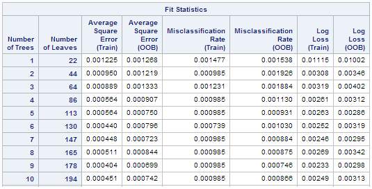
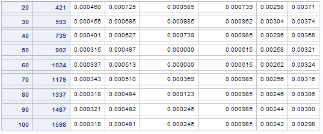
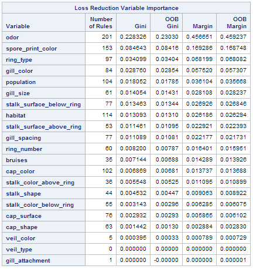

# Week 2 - Random Forests

## SAS Code
```sas
LIBNAME mydata "/courses/d1406ae5ba27fe300 " access=readonly;

/* Import the data from csv file */
PROC IMPORT DATAFILE='/home/petersaunders10/randomForests/mushrooms.csv' 
        OUT=mushroom_data REPLACE;
        
/* Build random forest for mushrooms WITHOUT stalk_root */        
PROC HPFOREST DATA=mushroom_data SEED=14723;
    TARGET edible /LEVEL=BINARY;
    INPUT cap_shape cap_surface cap_color 
        bruises odor gill_attachment gill_spacing 
        gill_size gill_color stalk_shape 
        stalk_surface_above_ring stalk_surface_below_ring 
        stalk_color_above_ring stalk_color_below_ring 
        veil_type veil_color ring_number ring_type 
        spore_print_color population habitat /LEVEL=NOMINAL;
    
RUN;
```

## Background
I acquired data on the edibility of mushrooms from the [University of California, Irvine Machine Learning Data repository](https://archive.ics.uci.edu/ml/datasets/Mushroom).

The dataset consists of 8124 instances with 23 variables, including the class variable of edible/poisonous.  This represents 8124 hypothetical instances of 23 different species of mushroom (not classified here).  There is no simple rule for determining the edibility of a mushroom so I want to build a random forest model which, given all the information about a particular mushroom, will predict (hopefully with a high degree of accuracy!) whether it is edible or not.

The variables are:

| Variate | Description |
| --- | --- |
|edible | edible=e, poisonous/unknown=p |
|cap_shape|                bell=b,conical=c,convex=x,flat=f,knobbed=k,sunken=s|
|cap_surface|             fibrous=f,grooves=g,scaly=y,smooth=s|
|cap_color|                brown=n,buff=b,cinnamon=c,gray=g,green=r, pink=p,purple=u,red=e,white=w,yellow=y|
|bruises|                 bruises=t,no=f|
|odor|                     almond=a,anise=l,creosote=c,fishy=y,foul=f, musty=m,none=n,pungent=p,spicy=s|
|gill_attachment|          attached=a,descending=d,free=f,notched=n|
|gill_spacing|             close=c,crowded=w,distant=d|
|gill_size|                broad=b,narrow=n|
|gill_color|               black=k,brown=n,buff=b,chocolate=h,gray=g,green=r, orange=o,pink=p,purple=u,red=e,white=w,yellow=y|
|stalk_shape|              enlarging=e,tapering=t|
|stalk_root|               bulbous=b,club=c,cup=u,equal=e,rhizomorphs=z,rooted=r,missing=?|
|stalk_surface_above_ring| fibrous=f,scaly=y,silky=k,smooth=s|
|stalk_surface_below_ring| fibrous=f,scaly=y,silky=k,smooth=s|
|stalk_color_above_ring|   brown=n,buff=b,cinnamon=c,gray=g,orange=o, pink=p,red=e,white=w,yellow=y|
|stalk_color_below_ring|   brown=n,buff=b,cinnamon=c,gray=g,orange=o, pink=p,red=e,white=w,yellow=y|
|veil_type|                partial=p,universal=u|
|veil_color|               brown=n,orange=o,white=w,yellow=y|
|ring_number|              none=n,one=o,two=t|
|ring_type|                cobwebby=c,evanescent=e,flaring=f,large=l, none=n,pendant=p,sheathing=s,zone=z|
|spore_print_color|        black=k,brown=n,buff=b,chocolate=h,green=r, orange=o,purple=u,white=w,yellow=y|
|population|               abundant=a,clustered=c,numerous=n, scattered=s,several=v,solitary=y|
|habitat|                  grasses=g,leaves=l,meadows=m, paths=p,urban=u,waste=w,woods=d|

The `stalk_root` column contains many missing data, coded using `?`, and this will need to be considered when doing the analysis.

## Analysis

I used the SAS `HPFOREST` procedure to build a random forest using all of the variables *except for* `stalk_root`.

I used the default parameters for `Variables to Try`, `Maximum Trees` etc.

## Results

The fit statistics, for increasing forest size are shown below:



We can see that the estimates for the out-of-sample (or out-of-bag) error rate for small forests (1-5 trees) is already very small, only 0.15 - 0.2%  As the forest size is increased this decreases towards 0.1%.

This suggests that the random forest method is actually unnecessary for this problem.  A single decision tree would do almost as well and would be much easier to interpret.  However, using the random forest method has produced a very accurate model.

The variable importance table was:


The `odor` variable is by far the most important in predicting whether a mushroom is edible or poisonous.  Looking at a simple decision tree...

